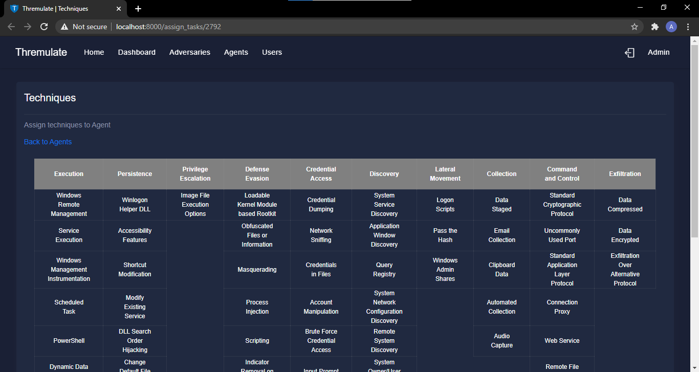
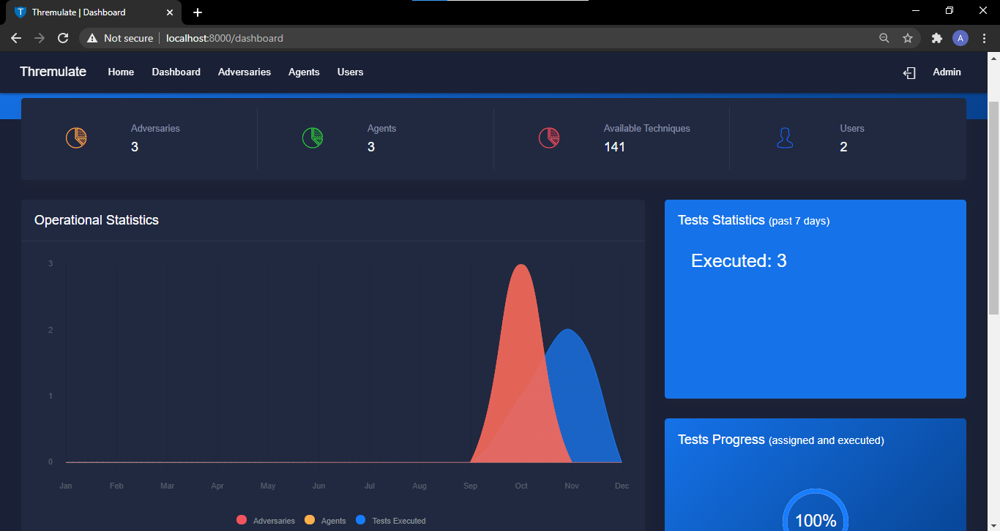

# Thremulate

Thremulate is a light weight adversary emulation application grounded on the MITRE [ATT&CK™](https://attack.mitre.org/) framework.
Thremulate's server and agent are platform independent. Therefore, you can execute over 140 adversarial techniques on Windows, Linux and MacOS operating systems. 

> Thremulate is currently in the quality assurance (QA) stage to identify and fix elusive bugs. This QA stage is still in progress and has so far been done on Windows and Linux systems only. MacOS will soon join the process. Therefore not all adversary techniques will work as expected. 

We promise, it will soon be production ready :ok_hand:. 


## Why should I use Thremulate?
- **Know Your Gaps in Detection:** 

  Security Administrators that desire to identify their organisation's gaps in detecting adversarial presence, can ably  use Thremulate to do so.

  **Security Assessments for All:** 
  Organizations that may not have a substantial IT security budget that supports regular red team engagements are able to leverage the power of Thremulate to test their defenses.

- **Security Monitoring Effectiveness:**
  Security personnel should validate their security monitoring effectiveness at preventing and identifying adversarial presence on the network. Thremulate helps you do this with utmost ease. Run an adversarial technique and confirm that its execution is stopped or detected as malicious.

- **Raise Information Security Awareness:**
The lead author created Thremulate to raise awareness about cyber threats out there in the wild inclined on compromising and/or destroying digital infrastructure. Thremulate is a spot-on example of how we can use Cyber Threat Intelligence (CTI) to validate and reinforce our defenses. 

## Features

1. ATT&CK Matrix of Available Techniques



2. Graphical View of Adversary Emulation Results


3. Analytics Dashboard



4. Multi-User for Team Collaboration


5. Authentication and Authorization

6. Living Off the Land techniques.

7. Fileless Tttack Techniques.

8. Responsive Web Interface

9. Easily Extensible Modular Design

10. And Many Other Features
## Use Cases

1. Adversary Emulation
2. Cyber Threat Intelligence (CTI)
3. IT Security Classes
4. Purple Team engagements
## Major requirement

- Python 3.5.3+

## Rule of Engagement

> **"ALWAYS OBTAIN WRITTEN PERMISSION FROM THE DULY AUTHORISED PERSON FOR THIS KIND OF ACTIVITY WHENEVER YOU ARE WORKING WITH INFRASTRUCTURE YOU DO NOT PERSONALLY OWN , OTHERWISE HAVE A COUPLE OF RESUMES AND DEFENCE LAWYERS READY"** 
>  *'The First Rule of Offensive Security',Mwesigwa Arnold  .*

## Installation

Start by cloning this repository.
```
git clone https://github.com/arnoldmw/thremulate.git 
```
Install the requirements for the project. It is recommended to create a new virtual environment for every new project.
```python
pip install -r requirements.txt
```
Start the sever
```python
python server.py
```

## Getting Started

* [Running Your First Adversary Emulation with Thremulate](docs/Quick_Start.md)

## ATT&CK Coverage

Checkout the [ list of tests](art/atomics/index.md) supported and the [ATT&CK Matrix](art/atomics/matrix.md)

- Windows [Tests](art/atomics/windows-index.md) and [Matrix](art/atomics/windows-matrix.md)
- MacOS [Tests](art/atomics/macos-index.md) and [Matrix](art/atomics/macos-matrix.md)
- Linux [Tests](art/atomics/linux-index.md) and [Matrix](art/atomics/linux-matrix.md)

## Contributing

This project is open to contributions. Guidelines for contributing can be found in the [CONTRIBUTING](CONTRIBUTING.md) file.


## Code of Conduct

In order to have a more open and welcoming community,the maintainers of this repository adhere to a
[code of conduct](docs/CODE_OF_CONDUCT.md).

## Author

1. [Arnold Mwesigwa](https://github.com/arnoldmw) (Maintainer/Author)

## License

See the [LICENSE](LICENSE.txt) file for more details.

## Acknowledgements

- [ATT&CK](https://attack.mitre.org/)
- [Atomic Red Team](https://github.com/redcanaryco/atomic-red-team)
- All the threat actors whose techniques I have implemented, I am (un)grateful.

## Support

Encountering problems? Open up an issue.

Got a private comment? Send an email to thremulate@gmail.com. (It is not fun running SIFT(forensic workstation) 
every time I read email. So keep it clean :wink:) 