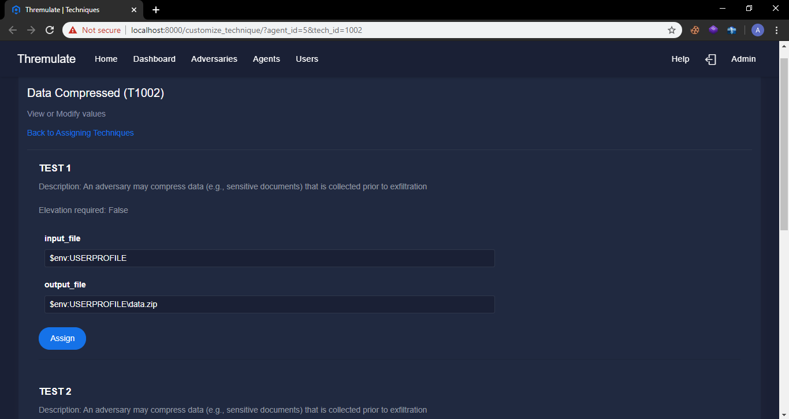

## Quick Start

Ready to run your first Thremulate adversary emulation? Thremulate agents can run both locally and remotely. This Quick Start example runs locally. To run this example using a remote Thremulate server, replace localhost with the IP address of the remote Thremulate server.
## 1. What should I start with?

- Start the Thremulate server first.

```
python server.py
```

- Using your favorite browser, navigate to **https://localhost:8000**.  Login with **admin@thremulate.com** as the username and **thremulate** as the password.

   ```
   https:\\localhost:8000
   username: admin@thremulate.com
   password: thremulate
   ```
   ## NOTE: Invalid SSL certificate warnings.
   
   Thremulate's SSL certificate is self signed and is therefore not among the trusted root certificates on your device. Browsers will warn you that 'Your connection is not private' or present any other similar message.The script that created the Thremulate's SSL certificate is in the certificate folder. You are free to generate your own certificate. Otherwise, simply add Thremulate's default certificate as an exception in Firefox and Safari. For the Google Chrome browser, click 'Advanced' and then click 'Proceed to localhost (unsafe)'.

## 2. I have logged into the Thremulate server. How can I deploy the Agent to the target computer?

   These are some of the ways you can deploy the agent to a target computer.

   - The Home page (https://localhost:8000/home) of an authenticated Thremulate user has platform specific commands that will deploy an agent to a target computer that executes them. Copy and paste them in the bash or command prompt or powershell terminal of the target computer. Run the commands on the target computer. For best results, use a terminal or console with Administrative or root privileges on the target computer while deploying the Agent to it. Ensure the Thremulate server instance IP in the commands is correct.
   - Transfer the Agent for the corresponding target platform using external storage media or FTP or any other viable means. The platform specific Agent lives in the **agents** folder found in the Thremulate root. Windows Agents are labelled win_agent.exe, Linux Agents are labelled lin_agent.exe. and MacOS Agents are labelled mac_agent.exe.

## 3. The Agent is on the target computer. What is next?

If you successfully pasted and ran the commands into the terminal or shell of the target computer when deploying the agent, then the Agent was deployed and automatically started for you.

If you used different means to deploy the Agent other than pasting the commands to the target's terminal, then you will have to navigate to the location of the Agent, and start the Agent on the target computer via the terminal or shell while passing the IP address of the Thremulate server.
Depending on the Agent you have, run it with the following commands. Replace **[THREMULATE_SERVER_IP]** with the actual IP of your Thremulate server instance.

   ```
   win_agent.exe -s [THREMULATE_SERVER_IP] OR 
   lin_agent -s [THREMULATE_SERVER_IP]
   agent.py -s [THREMULATE_SERVER_IP]
   Examples: agent.py -s localhost and win_agent -s 127.0.0.1
   ```

## 4. After the Agent started, it said it has or had registered. Great!! You are now ready to do adversary emulation with Thremulate.

- In the browser navigate to the https://localhost:8000/agents. This leads you to a page which shows all the agents that have registered with the Thremulate server. If you get Error 404, navigate to https://localhost:8000/login and login. 

- A random name was assigned to your Agent. You can change it later by clicking on the Edit button that shows the 'Update Agent' tooltip. Access tooltips by hovering over the buttons. To assign an agent techniques to execute, click on the 'Play' button with the 'Assign techniques' tooltip. 

- Clicking on the 'Play' button will lead to an ATT&CK Matrix showing all the ATT&CK techniques available for execution by that Agent. To assign that Agent a technique to execute, click on a Technique you would like to execute.


- You can view or modify the execution parameters of the technique before assigning it an agent.

  >**NOTE: A technique may have multiple tests or implementations in order to have better coverage.**



- Wait for at least 6 seconds for the Agent to execute the assigned techniques. The Agent by default checks for new tasks every 5 seconds. This can later be changed to any value by using the -i or --interval flag when starting the Agent via the terminal or shell.

## 5. Agent says it executed TXXXX:X. How do I view the results of the techniques the Agent executed?

- Navigate to https://localhost:8000/agents. In the row with your Agent's unique number or name, click on the 'Information' button with the 'More information' tooltip.

- This will show you all the techniques associated with that Agent and their respective analysis.You can delete the output of a particular technique implementation in order for the Agent to re-run it or even remove the technique implementation from the Agent.
- If you wish to view output from the Agent, click on the name of the technique implementation. The accordion will expand to show  the raw output received from the Agent.


## 6. And that is your first adversary emulation with Thremulate. Congratulations!!

Have a peek at your insightful dashboard to view your progress and run more techniques if the charts are flat. Happy Thremulating.

